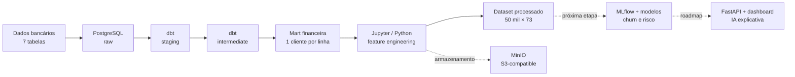

# FinPulse AI

### Plataforma de Inteligência Financeira para Open Finance

Transformando dados bancários relacionais em perfis financeiros, indicadores explicáveis, modelos preditivos e decisões acionáveis.


---

## Sobre o projeto

O **FinPulse AI** é um projeto end-to-end de dados e inteligência artificial aplicado ao contexto de fintech e Open Finance.

A plataforma parte de um dataset bancário relacional com **1,26 milhão de registros**, organiza os dados em uma arquitetura analítica com PostgreSQL e dbt e os transforma em uma visão financeira consolidada por cliente. Sobre essa base são construídas features, scores explicáveis e, nas próximas etapas, modelos de churn, detecção de anomalias, recomendações, API, dashboard e um assistente financeiro com IA generativa.

> **Status atual:** infraestrutura local, carga de dados, validações, camada dbt e primeira etapa de feature engineering concluídas. Integração com MLflow e modelagem de churn são as próximas entregas.

## Problema de negócio

O FinPulse AI busca responder perguntas como:

- Quais clientes apresentam sinais de desengajamento?
- Quais clientes precisam de atenção financeira?
- Onde existe maior exposição a crédito?
- Quais comportamentos podem indicar anomalias?
- Que produto ou ação pode ser recomendado para cada perfil?
- Como explicar scores e previsões de maneira clara e acionável?

## Arquitetura



| Serviço | Função | Porta |
|---|---|---:|
| PostgreSQL 16 | Banco transacional e camadas analíticas | `5433` |
| pgAdmin | Administração do PostgreSQL | `5050` |
| MinIO | Data lake S3-compatible | `9000` / `9001` |
| Jupyter | Análises, features e modelagem | `8888` |

## Dados

| Tabela | Registros |
|---|---:|
| `customers` | 50.000 |
| `accounts` | 75.000 |
| `cards` | 100.000 |
| `transactions` | 1.000.000 |
| `merchants` | 5.000 |
| `branches` | 500 |
| `loans` | 30.000 |
| **Total** | **1.260.500** |

Os arquivos volumosos de dados e inserção não são versionados no GitHub. As validações cobrem contagens, duplicidades, nulos críticos, integridade referencial, valores financeiros, datas e relacionamentos.

## Transformações com dbt

### Staging

`stg_customers` · `stg_accounts` · `stg_cards` · `stg_transactions` · `stg_merchants` · `stg_branches` · `stg_loans`

### Intermediate

`int_customer_account_summary` · `int_customer_card_summary` · `int_customer_loan_summary` · `int_customer_transaction_summary`

### Mart

A `dbt.mart_customer_financial_profile` consolida perfil, contas, saldos, cartões, empréstimos e comportamento transacional.

| Resultado | Valor |
|---|---:|
| Granularidade | 1 linha por cliente |
| Clientes | 50.000 |
| Colunas analíticas | 45 |
| Tempo observado de materialização | 3,72 s |

## Feature engineering

| Grupo | Exemplos |
|---|---|
| Tempo e recência | `customer_tenure_days`, `days_since_last_transaction` |
| Contas e saldos | `balance_per_account`, `balance_concentration_ratio` |
| Cartões | `credit_card_ratio`, `card_product_diversity` |
| Crédito e empréstimos | `loan_to_balance_ratio`, `loan_intensity` |
| Comportamento transacional | `amount_per_transaction`, `merchant_diversity_ratio` |
| Relacionamento | `relationship_depth`, `product_diversity_score` |
| Risco e resiliência | `debt_pressure_flag`, `financial_resilience_proxy` |

O dataset final possui **50.000 clientes, 73 colunas e nenhum cliente duplicado**. A saída local é salva em `data/processed/customer_financial_features.csv`.

## Camadas analíticas atuais

### Churn Risk Score

Proxy comportamental de risco de desengajamento baseada em recência, frequência, profundidade do relacionamento e diversidade de produtos.

| Segmento | Clientes |
|---|---:|
| Low | 36.765 |
| Medium | 2.059 |
| High | 11.176 |

A label binária derivada possui **22,35%** de clientes em alto risco. Como não existe churn real observado no dataset, essa limitação será considerada explicitamente na modelagem.

### Financial Health Score V1

Score explicável de **0 a 100**, composto por força de saldo, pressão de dívida, engajamento transacional, relacionamento e resiliência financeira.

| Segmento | Clientes |
|---|---:|
| Critical | 14.325 |
| Attention | 17.703 |
| Healthy | 17.972 |

> Trata-se de uma proxy analítica educacional, não de um score de crédito oficial ou regra regulatória.

## Estrutura do repositório

```text
finpulse-ai/
├── data/{raw,processed,curated}
├── dbt/finpulse_dbt/
├── docs/
├── models/
├── notebooks/
├── reports/
├── sql/{ddl,inserts,quality}
├── src/
├── docker-compose.yml
└── README.md
```

## Como executar

```bash
git clone https://github.com/isaiasjusto/finpulse-ai.git
cd finpulse-ai
docker compose up -d
docker compose ps
```

Acessos locais:

- pgAdmin: http://localhost:5050
- Jupyter: http://localhost:8888
- MinIO Console: http://localhost:9001
- PostgreSQL externo: `127.0.0.1:5433`

Para executar as transformações:

```bash
cd dbt/finpulse_dbt
dbt debug
dbt run
dbt test
```

> As credenciais atuais são exclusivas para desenvolvimento local. Em produção, devem ser substituídas por variáveis de ambiente e gerenciamento seguro de segredos.

## Roadmap

- [x] Ambiente local com Docker Compose
- [x] PostgreSQL, pgAdmin, MinIO e Jupyter
- [x] Carga e qualidade das sete tabelas bancárias
- [x] Camadas dbt staging, intermediate e mart
- [x] Feature engineering
- [x] Churn Risk Score comportamental
- [x] Financial Health Score V1
- [x] Exportação do dataset processado
- [ ] MLflow Tracking Server com PostgreSQL e MinIO
- [ ] Baselines de churn
- [ ] XGBoost/CatBoost com aceleração por GPU
- [ ] Otimização com Optuna
- [ ] Model Registry e modelo campeão
- [ ] Detecção de anomalias
- [ ] Camada de recomendações
- [ ] Orquestração com Airflow
- [ ] API com FastAPI
- [ ] Dashboard com Streamlit
- [ ] Assistente inteligente com LLM/LangChain
- [ ] Evolução para AWS S3 e SageMaker

## Próxima etapa

A próxima entrega integra MLflow ao Docker, usa PostgreSQL como backend e MinIO para artefatos. Em seguida, o notebook `02_churn_risk_model.ipynb` comparará Logistic Regression, modelos de árvores, XGBoost e CatBoost, com aceleração pela RTX 5060 quando suportada e otimização via Optuna.

As métricas principais serão recall, F1-score, PR-AUC, ROC-AUC e tempo de inferência. A modelagem excluirá `churn_risk_score`, `churn_risk_segment` e `churn_risk_label` das features para evitar vazamento de target.

## Tecnologias

**Implementadas:** Python · Pandas · scikit-learn · PostgreSQL · dbt · Docker · Jupyter · MinIO

**Planejadas:** MLflow · Optuna · XGBoost · CatBoost · Airflow · FastAPI · Streamlit · LangChain · AWS S3 · SageMaker

## Autor

**Isaias Justo**

Projeto de portfólio em Engenharia de Dados, Ciência de Dados, Machine Learning e Inteligência Artificial aplicada ao setor financeiro.

[LinkedIn](https://www.linkedin.com/in/isaias-justo-a8b998185/) · [GitHub](https://github.com/isaiasjusto)

---

Se este projeto foi útil ou interessante, considere deixar uma ⭐ no repositório.
