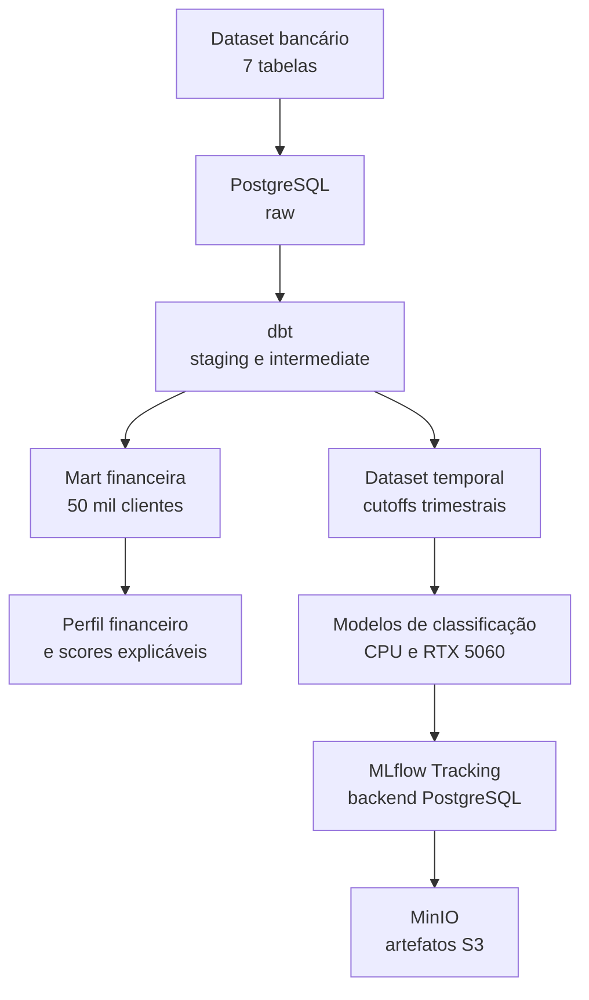

# FinPulse AI

### Plataforma de Inteligência Financeira para Open Finance

Transformando dados bancários relacionais em perfis financeiros, datasets temporais, experimentos rastreáveis e decisões acionáveis.


---

## Sobre o projeto

O **FinPulse AI** é um projeto end-to-end de Engenharia de Dados, Ciência de Dados e MLOps aplicado ao contexto de fintech e Open Finance.

A plataforma parte de um dataset bancário relacional sintético com **1,26 milhão de registros**, organiza os dados no PostgreSQL com transformações dbt e constrói duas camadas analíticas complementares:

- um perfil financeiro atual por cliente, voltado a indicadores explicáveis e dashboard;
- um dataset supervisionado temporal, voltado à previsão de inatividade transacional futura.

O ambiente é executado localmente com Docker Compose. O MLflow utiliza PostgreSQL como backend de tracking e MinIO como armazenamento S3-compatible para artefatos. Modelos de gradient boosting também foram executados com aceleração CUDA em uma NVIDIA RTX 5060.

> **Status atual:** infraestrutura, carga, qualidade, dbt, perfil financeiro, dataset temporal v1, validação temporal, MLflow e primeiros experimentos de classificação concluídos. A próxima iteração criará novas features temporais para o dataset v2.

## Problema de negócio

O projeto busca responder perguntas como:

- Quais clientes apresentam sinais de desengajamento transacional?
- Quais clientes podem ficar inativos nos próximos 90 dias?
- Quais clientes precisam de atenção financeira?
- Onde existe maior exposição a crédito e pressão de dívida?
- Quais comportamentos podem indicar anomalias?
- Como transformar previsões e scores em ações explicáveis?

### Definição responsável do target

O dataset não possui cancelamento contratual real. Portanto, o modelo não afirma prever encerramento de conta. O target utilizado é uma **proxy de inatividade transacional futura**:

- `0`: houve pelo menos uma transação nos 90 dias seguintes ao cutoff;
- `1`: não houve transação nos 90 dias seguintes ao cutoff.

Cada cliente precisa ter pelo menos uma transação nos 180 dias anteriores para ser elegível. Todas as features são calculadas apenas com dados disponíveis até a data de corte.

## Aprendizado central: prevenção de leakage

A primeira hipótese de churn utilizava uma label heurística derivada das mesmas variáveis oferecidas ao modelo. Uma regra baseada em `has_transaction` reproduzia essa label com aproximadamente 99,9% de acurácia, revelando vazamento circular de target.

A abordagem foi descartada. O problema foi reconstruído temporalmente, separando claramente:

- janela histórica de observação;
- data de cutoff;
- janela futura de predição;
- treino, validação, embargo e teste.

Esse diagnóstico faz parte do resultado do projeto: métricas artificialmente perfeitas foram substituídas por uma avaliação temporal honesta e reproduzível.

## Arquitetura atual



| Serviço | Função | Porta |
|---|---|---:|
| PostgreSQL 16 | Dados relacionais, camadas dbt e backend do MLflow | `5433` |
| pgAdmin | Administração do PostgreSQL | `5050` |
| MinIO | Data lake e artefatos S3-compatible | `9000` / `9001` |
| MLflow | Experimentos, métricas, datasets e artefatos | `5000` |
| Jupyter | Feature engineering e treinamento | `8888` |

## Dados

| Tabela | Registros |
|---|---:|
| `customers` | 50.000 |
| `accounts` | 75.000 |
| `cards` | 100.000 |
| `transactions` | 1.000.000 |
| `merchants` | 5.000 |
| `branches` | 500 |
| `loans` | 30.000 |
| **Total** | **1.260.500** |

Arquivos volumosos e artefatos locais não são versionados. As validações cobrem contagens, duplicidades, nulos críticos, integridade referencial, valores financeiros e coerência temporal.

### Limitação temporal encontrada

As datas sintéticas de criação de clientes, abertura de contas e início de empréstimos apresentam inconsistências sistemáticas. Elas não são utilizadas na modelagem temporal. A referência temporal confiável é o histórico observado de transações.

## Transformações com dbt

### Staging

`stg_customers` · `stg_accounts` · `stg_cards` · `stg_transactions` · `stg_merchants` · `stg_branches` · `stg_loans`

### Intermediate

`int_customer_account_summary` · `int_customer_card_summary` · `int_customer_loan_summary` · `int_customer_transaction_summary`

### Mart

A `dbt.mart_customer_financial_profile` consolida perfil, contas, saldos, cartões, empréstimos e comportamento transacional em uma linha por cliente.

## Notebooks

### 01 — Financial Profile Feature Engineering

Constrói o perfil financeiro atual com **50.000 clientes e 75 colunas**, incluindo:

- contas, saldos e concentração financeira;
- cartões e diversidade de produtos;
- empréstimos e pressão de dívida;
- comportamento transacional;
- Financial Health Score;
- heurística descritiva de desengajamento.

A heurística de desengajamento não é utilizada como target supervisionado.

### 02 — Temporal Inactivity Dataset

Constrói um dataset point-in-time usando somente histórico anterior ao cutoff.

| Propriedade | Valor |
|---|---:|
| Snapshots cliente-cutoff | 658.587 |
| Cutoffs trimestrais | 22 |
| Janela de observação | 180 dias |
| Janela de predição | 90 dias |
| Features iniciais | 18 |
| Colunas finais | 22 |
| Taxa geral de inatividade | 41,37% |

Split temporal:

| Partição | Linhas | Uso |
|---|---:|---|
| Treino | 448.919 | Ajuste dos modelos |
| Validação | 89.934 | Comparação e early stopping |
| Teste | 59.902 | Reservado para avaliação final |
| Embargo | 59.832 | Prevenção de sobreposição temporal |

O dataset, os metadados e o resumo dos splits são registrados no MLflow; os artefatos são persistidos no MinIO.

### 03 — Transaction Inactivity Prediction

Compara modelos lineares e não lineares utilizando a mesma validação temporal. Após a análise de redundância, um conjunto reduzido de 13 features foi usado nos modelos principais.

Resultados atuais na validação:

| Modelo | Processamento | ROC AUC | Average Precision |
|---|---|---:|---:|
| DummyClassifier | CPU | 0,5000 | 0,4143 |
| Logistic Regression | CPU | 0,5973 | 0,4833 |
| HistGradientBoosting | CPU | 0,5970 | 0,4816 |
| XGBoost | RTX 5060 / CUDA | **0,5980** | **0,4838** |
| CatBoost | RTX 5060 / CUDA | 0,5971 | 0,4762 |

Os quatro modelos treináveis convergiram para desempenho semelhante. Isso indica que o principal gargalo atual está no sinal disponível nas features, não apenas na escolha do algoritmo.

O threshold de classificação ainda não foi escolhido e o conjunto de teste permanece reservado.

## MLflow e MinIO

O experimento `finpulse_temporal_dataset` registra:

- definição e versão do dataset;
- target, janelas e cutoffs;
- distribuição dos splits;
- métricas de inatividade;
- Parquet temporal;
- metadados JSON;
- resumo dos splits.

O PostgreSQL armazena os metadados de tracking e o bucket `mlflow` no MinIO armazena os artefatos.

## Estrutura do repositório

```text
finpulse-ai/
├── data/{raw,processed,curated}
├── dbt/finpulse_dbt/
├── docker/
│   └── mlflow/Dockerfile
├── docs/
├── models/
├── notebooks/
│   ├── 01_feature_engineering_financial_profile.ipynb
│   ├── 02_churn_temporal_dataset.ipynb
│   └── 03_churn_risk_model.ipynb
├── reports/
├── sql/{ddl,inserts,quality}
├── src/
├── docker-compose.yml
└── README.md
```

## Como executar

### Pré-requisitos

- Docker Desktop com backend WSL2;
- Docker Compose;
- driver NVIDIA atualizado para treinamento GPU;
- aproximadamente 8 GB de memória disponível para os serviços locais.

```bash
git clone https://github.com/isaiasjusto/finpulse-ai.git
cd finpulse-ai
docker compose up -d --build
docker compose ps
```

Acessos locais:

- pgAdmin: http://localhost:5050
- Jupyter: http://localhost:8888
- MinIO Console: http://localhost:9001
- MLflow: http://localhost:5000
- PostgreSQL externo: `127.0.0.1:5433`

O token do Jupyter pode ser recuperado com:

```bash
docker exec finpulse_jupyter jupyter server list
```

Para executar as transformações dbt:

```bash
cd dbt/finpulse_dbt
dbt debug
dbt run
dbt test
```

> As credenciais presentes no Compose são exclusivas para desenvolvimento local. Uma implantação real deve utilizar variáveis de ambiente e gerenciamento seguro de segredos.

## Roadmap

- [x] Ambiente local com Docker Compose
- [x] PostgreSQL, pgAdmin, MinIO e Jupyter
- [x] Carga e qualidade das sete tabelas bancárias
- [x] Camadas dbt staging, intermediate e mart
- [x] Perfil financeiro e Financial Health Score
- [x] Auditoria de qualidade temporal
- [x] Target temporal sem vazamento circular
- [x] Dataset com treino, validação, embargo e teste
- [x] MLflow Tracking Server com PostgreSQL e MinIO
- [x] Baselines Dummy e Logistic Regression
- [x] HistGradientBoosting
- [x] XGBoost e CatBoost com RTX 5060
- [ ] Dataset temporal v2 com novas features
- [ ] Otimização dos modelos campeões
- [ ] Escolha de threshold orientada ao negócio
- [ ] Avaliação única no conjunto de teste
- [ ] Model Registry e promoção do campeão
- [ ] Detecção de anomalias
- [ ] Camada de recomendações
- [ ] Orquestração com Airflow
- [ ] API com FastAPI
- [ ] Dashboard com Streamlit
- [ ] Assistente inteligente com LLM/LangChain
- [ ] Evolução para AWS S3 e SageMaker

## Próxima etapa

A próxima iteração criará um dataset temporal `v2`, preservando a versão atual como baseline. As novas features explorarão intervalos entre transações, regularidade mensal, tendência, volatilidade, sequências de inatividade e histórico de 180 a 360 dias antes do cutoff.

Se diferentes famílias de modelos continuarem próximas de ROC AUC 0,60 após essa evolução, a limitação será documentada como característica do gerador sintético, sem fabricar desempenho artificial.

## Tecnologias

**Implementadas:** Python · Pandas · scikit-learn · PostgreSQL · dbt · Docker · Jupyter · MinIO · MLflow · XGBoost · CatBoost · CUDA

**Planejadas:** Optuna · Airflow · FastAPI · Streamlit · LangChain · AWS S3 · SageMaker

## Autor

**Isaias Justo**

Projeto de portfólio em Engenharia de Dados, Ciência de Dados, Machine Learning e Inteligência Artificial aplicada ao setor financeiro.

[LinkedIn](https://www.linkedin.com/in/isaias-justo-a8b998185/) · [GitHub](https://github.com/isaiasjusto)

---

Se este projeto foi útil ou interessante, considere deixar uma ⭐ no repositório.
