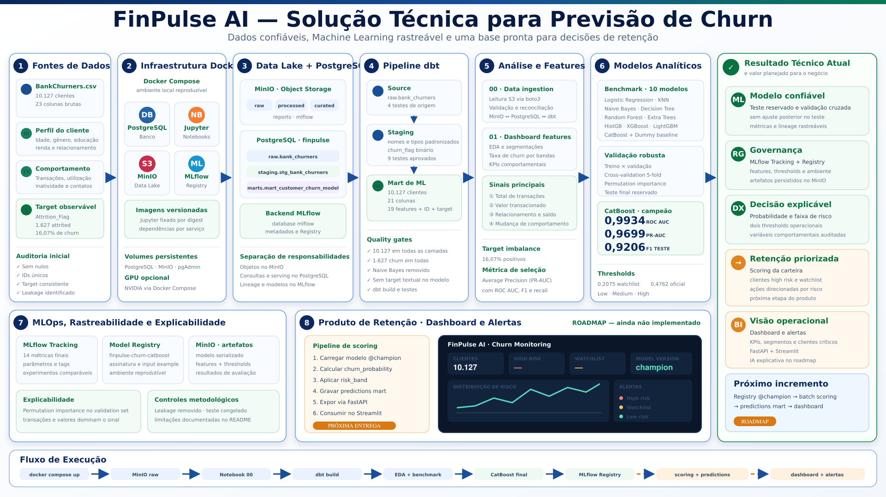

# FinPulse AI

### Plataforma end-to-end de dados, Machine Learning e MLOps para previsão de churn bancário

[](https://www.python.org/)
[](https://www.postgresql.org/)
[](https://www.getdbt.com/)
[](https://mlflow.org/)
[](https://min.io/)
[](https://www.docker.com/)
[](#status-do-projeto)



## Visão geral

O **FinPulse AI** transforma dados de clientes de cartão de crédito em uma solução rastreável de previsão de churn. O projeto cobre o fluxo completo entre armazenamento, qualidade, transformação analítica, experimentação, validação e registro do modelo.

O objetivo é estimar a probabilidade de um cliente encerrar o relacionamento e disponibilizar esse sinal para ações de retenção, alertas e dashboards.

O projeto foi construído como portfólio prático de:

- Engenharia de Dados;
- Analytics Engineering com dbt;
- Ciência de Dados e Machine Learning;
- MLOps com MLflow e MinIO;
- arquitetura local reproduzível com Docker Compose.

## Resultado atual

O CatBoost foi selecionado como modelo campeão após benchmark de dez algoritmos, análise de overfitting e validação cruzada.

| Métrica no teste reservado | Resultado |
|---|---:|
| ROC AUC | **0,9934** |
| Average Precision | **0,9699** |
| Accuracy | **0,9753** |
| Balanced Accuracy | **0,9417** |
| Precision | **0,9508** |
| Recall | **0,8923** |
| F1-score | **0,9206** |

Matriz de confusão no threshold oficial:

| Resultado | Clientes |
|---|---:|
| True Negative | 1.686 |
| False Positive | 15 |
| False Negative | 35 |
| True Positive | 290 |

Essas métricas representam uma única avaliação no conjunto de teste reservado após a escolha do algoritmo e dos thresholds na validação.

## Problema de negócio

Uma instituição financeira precisa priorizar clientes para ações de retenção sem abordar toda a carteira indiscriminadamente.

O modelo responde:

> Qual é a probabilidade de churn deste cliente e em qual faixa de risco ele deve ser classificado?

Foram definidos dois pontos de operação:

| Uso | Threshold aproximado | Objetivo |
|---|---:|---|
| Watchlist | `0,2075` | aumentar cobertura de clientes potencialmente em risco |
| Classificação oficial | `0,4762` | equilibrar precision e recall pelo melhor F1 na validação |

As faixas planejadas para consumo são:

```text
Low     probability < 0.2075
Medium  0.2075 <= probability < 0.4762
High    probability >= 0.4762
```

## Dataset

O projeto utiliza o arquivo `BankChurners.csv`, disponibilizado no dataset público [Credit Card Customers](https://www.kaggle.com/datasets/sakshigoyal7/credit-card-customers).

| Característica | Valor |
|---|---:|
| Clientes | 10.127 |
| Clientes existentes | 8.500 |
| Clientes em churn | 1.627 |
| Taxa de churn | 16,07% |
| Colunas brutas | 23 |
| Features usadas pelo modelo | 19 |
| Valores nulos | 0 |
| Clientes duplicados | 0 |

O target original é `Attrition_Flag`, transformado no mart em `churn_flag`.

As duas colunas `Naive_Bayes_Classifier_*` foram removidas antes da modelagem por apresentarem vazamento direto do target. O identificador do cliente e o texto original da classe também não são utilizados como features.

> O CSV não é versionado neste repositório. Consulte as condições de uso da fonte e faça o upload do arquivo para o bucket `raw` do MinIO.

## Arquitetura

```text
BankChurners.csv
        ↓
MinIO / raw
        ↓
PostgreSQL / raw.bank_churners
        ↓
dbt / staging.stg_bank_churners
        ↓
dbt / marts.mart_customer_churn_model
        ↓
Jupyter / EDA, benchmark e validação
        ↓
MLflow Tracking + Model Registry
        ↓
MinIO / artefatos do modelo
```

Responsabilidades por componente:

| Componente | Responsabilidade |
|---|---|
| MinIO | dado bruto e artefatos S3-compatible |
| PostgreSQL | camada relacional, backend do MLflow e serving futuro |
| dbt | staging, mart, documentação e testes de qualidade |
| Jupyter | ingestão, análise, treinamento e validação |
| MLflow | experimentos, métricas, parâmetros, lineage e Registry |
| Docker Compose | reprodução e comunicação entre os serviços |

## Camadas de dados

### Raw

`raw.bank_churners` preserva a granularidade de um cliente por linha.

### Staging

`staging.stg_bank_churners` padroniza nomes, tipos e target. Os testes cobrem identificador, unicidade, valores aceitos e campos críticos.

### Mart de Machine Learning

`marts.mart_customer_churn_model` entrega 10.127 clientes e 21 colunas:

- `customer_id`;
- `churn_flag`;
- 19 features numéricas e categóricas;
- nenhuma coluna direta de leakage.

As contagens de clientes e churn foram reconciliadas entre MinIO, raw, staging e mart.

## Metodologia de Machine Learning

### Separação dos dados

Como o dataset não possui uma coluna temporal de observação, foi utilizado split estratificado:

- 60% treino;
- 20% validação;
- 20% teste reservado.

O teste foi utilizado uma única vez após a seleção do modelo e do threshold.

### Benchmark

Foram avaliados:

1. Logistic Regression;
2. K-Nearest Neighbors;
3. Gaussian Naive Bayes;
4. Decision Tree;
5. Random Forest;
6. Extra Trees;
7. HistGradientBoosting;
8. XGBoost;
9. LightGBM;
10. CatBoost;
11. Dummy Classifier como baseline.

A seleção considerou principalmente **Average Precision**, adequada ao desbalanceamento do target, além de ROC AUC, balanced accuracy, precision, recall e F1.

Também foram realizados:

- comparação entre treino e validação;
- validação cruzada estratificada com cinco folds;
- permutation importance;
- análise de precision, recall e F1 por threshold;
- avaliação final em conjunto de teste congelado.

As variáveis com maior importância foram `total_transaction_count` e `total_transaction_amount`, seguidas por sinais de relacionamento, saldo rotativo e mudança de comportamento.

## MLOps

O experimento final é rastreado no MLflow com:

- parâmetros do modelo;
- métricas oficiais e de watchlist;
- features numéricas e categóricas;
- thresholds e faixas de risco;
- resultados do teste final;
- assinatura e exemplo de entrada;
- pipeline completo do CatBoost.

O modelo registrado é:

```text
finpulse-churn-catboost
```

O PostgreSQL armazena metadados do MLflow e o MinIO armazena os artefatos. A comunicação Jupyter → MLflow → MinIO foi validada após a reconstrução das imagens Docker.

## Estrutura do projeto

```text
finpulse-ai/
├── data/
│   ├── raw/
│   ├── processed/
│   └── curated/
├── dbt/finpulse_dbt/
│   ├── macros/
│   └── models/
│       ├── staging/
│       └── marts/
├── docker/
│   ├── jupyter/
│   ├── mlflow/
│   └── postgres/init/
├── docs/architecture/
├── notebooks/
│   ├── 00_churn_data_ingestion.ipynb
│   ├── 01_churn_dashboard_features.ipynb
│   └── 02_churn_model_training.ipynb
├── models/
├── reports/
├── src/
├── docker-compose.yml
└── README.md
```

## Como executar

### Pré-requisitos

- Docker Desktop com Docker Compose;
- Git;
- acesso ao arquivo `BankChurners.csv`;
- GPU NVIDIA opcional.

### 1. Clone o repositório

```bash
git clone https://github.com/isaiasjusto/finpulse-ai.git
cd finpulse-ai
```

### 2. Construa e inicie os serviços

```bash
docker compose up -d --build
docker compose ps
```

Serviços locais:

| Serviço | URL ou porta |
|---|---|
| JupyterLab | `http://localhost:8888` |
| MLflow | `http://localhost:5000` |
| pgAdmin | `http://localhost:5050` |
| MinIO API | `http://localhost:9000` |
| MinIO Console | `http://localhost:9001` |
| PostgreSQL | `localhost:5433` |

Na primeira inicialização, o Compose prepara o banco do MLflow, o usuário do dbt e os buckets `raw`, `processed`, `curated`, `reports` e `mlflow`. Os modelos registrados e seus artefatos são armazenados pelo MLflow no bucket `mlflow`; portanto, não é necessário manter um bucket separado chamado `models`.

### 3. Disponibilize o dado bruto

No console do MinIO, envie:

```text
raw/BankChurners.csv
```

Depois execute `00_churn_data_ingestion.ipynb` para ingestão e validação das camadas.

### 4. Execute o dbt

O projeto foi validado com `dbt-core 1.11.12` e `dbt-postgres 1.10.2`.

Configure o profile `finpulse_dbt` e execute:

```bash
cd dbt/finpulse_dbt
dbt build
```

Em ambientes onde o executável `dbt` é bloqueado, a CLI também pode ser chamada pelo `dbtRunner` em Python.

### 5. Execute os notebooks

```text
00_churn_data_ingestion.ipynb
01_churn_dashboard_features.ipynb
02_churn_model_training.ipynb
```

## Reprodutibilidade

- versões Python fixadas em `requirements.txt` por serviço;
- imagem do Jupyter fixada por digest;
- MLflow, CatBoost, XGBoost e LightGBM versionados;
- volumes persistentes para PostgreSQL e MinIO;
- inicialização automática de banco, usuário, schemas e buckets;
- testes de comunicação entre Jupyter, MLflow e MinIO.

As credenciais presentes no Compose são exclusivas para desenvolvimento local. Um ambiente produtivo deve utilizar secrets e usuários com privilégios mínimos.

## Limitações

- O dataset é público e educacional, não representa uma carteira bancária em produção.
- Não existe timestamp de referência para realizar validação temporal; por isso o split é estratificado.
- As métricas refletem este dataset e não devem ser generalizadas para outra população sem nova validação.
- A alta capacidade preditiva depende principalmente de variáveis transacionais fortemente associadas ao target.
- O projeto não representa recomendação financeira, score regulatório ou decisão automática de crédito.

## Status do projeto

- [x] Ambiente Docker com PostgreSQL, MinIO, Jupyter, pgAdmin e MLflow
- [x] Dependências versionadas e imagens reproduzíveis
- [x] Ingestão e validação do dado bruto
- [x] Modelos dbt de staging e mart
- [x] Testes de qualidade e auditoria de leakage
- [x] EDA e features para dashboard
- [x] Benchmark de dez modelos
- [x] Análise de overfitting e validação cruzada
- [x] CatBoost avaliado no teste reservado
- [x] MLflow Tracking e Model Registry
- [x] Artefatos persistidos no MinIO
- [ ] Validação de load-back e alias `champion`
- [ ] Batch scoring dos clientes
- [ ] Mart de predições no PostgreSQL
- [ ] API com FastAPI
- [ ] Dashboard com Streamlit
- [ ] Alertas e camada de IA explicativa

## Próxima etapa

O próximo incremento carregará o modelo pelo alias `champion`, calculará a probabilidade de churn dos clientes e gravará no PostgreSQL:

```text
customer_id
churn_probability
predicted_churn
risk_band
model_version
scored_at
```

Essa tabela alimentará o dashboard e os futuros alertas de retenção.

## Autor

**Isaias Justo**  
Data Scientist | Machine Learning | Analytics & Data Engineering

[LinkedIn](https://www.linkedin.com/in/isaias-justo-a8b998185/) · [GitHub](https://github.com/isaiasjusto)

---

Se este projeto foi útil ou interessante, considere deixar uma ⭐ no repositório.
