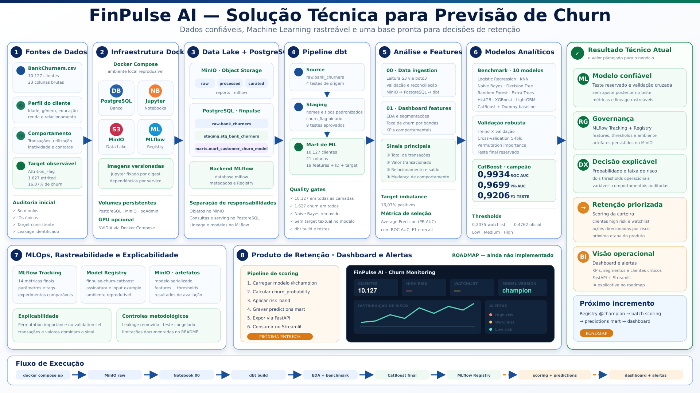

# FinPulse AI

### Plataforma end-to-end de dados, Machine Learning e MLOps para previsão de churn e priorização de retenção bancária

[](https://www.python.org/)
[](https://www.postgresql.org/)
[](https://www.getdbt.com/)
[](https://mlflow.org/)
[](https://min.io/)
[](https://fastapi.tiangolo.com/)
[](https://streamlit.io/)
[](https://www.docker.com/)
[](#status-do-projeto)



## Visão geral

O **FinPulse AI** transforma dados de clientes de cartão de crédito em uma solução rastreável de previsão de churn e apoio à retenção. O projeto cobre o fluxo completo entre armazenamento, qualidade, transformação analítica, treinamento, validação, registro, serving e consumo das previsões em um dashboard operacional.

Além de estimar a probabilidade de cancelamento, a plataforma organiza a carteira por faixa de risco e prioridade, permite analisar clientes críticos e apresenta métricas, matriz de confusão, explicabilidade global e individual com SHAP e rastreabilidade do modelo champion.

O projeto foi construído como portfólio prático de:

- Engenharia de Dados;
- Analytics Engineering com dbt;
- Ciência de Dados e Machine Learning;
- MLOps com MLflow e MinIO;
- model serving com FastAPI;
- explicabilidade de modelos com SHAP;
- aplicações analíticas com Streamlit;
- arquitetura local reproduzível com Docker Compose.

## Resultado atual

O CatBoost foi selecionado como modelo champion após benchmark de dez algoritmos, análise de overfitting, validação cruzada e avaliação em teste reservado.

| Métrica no teste reservado | Resultado |
|---|---:|
| ROC AUC | **0,9934** |
| Average Precision | **0,9699** |
| Accuracy | **0,9753** |
| Balanced Accuracy | **0,9417** |
| Precision | **0,9508** |
| Recall | **0,8923** |
| F1-score | **0,9206** |

Matriz de confusão no threshold oficial:

| Resultado | Clientes |
|---|---:|
| True Negative | 1.686 |
| False Positive | 15 |
| False Negative | 35 |
| True Positive | 290 |

Essas métricas representam uma única avaliação no conjunto de teste reservado após a escolha do algoritmo e dos thresholds na validação.

A solução operacional atualmente entrega:

- modelo `finpulse-churn-catboost`, versão 3, registrado com alias `champion`;
- batch scoring dos 10.127 clientes;
- previsões persistidas no PostgreSQL e snapshot em Parquet no MinIO;
- FastAPI `0.5.0` com endpoints de scoring, clientes, avaliação e explicabilidade;
- dashboard multipágina em Streamlit;
- priorização de retenção por risco e relevância de negócio;
- explicabilidade global com SHAP para as 19 features originais;
- explicabilidade individual com separação dos fatores que aumentam e reduzem o risco;
- rastreabilidade entre treinamento, versão do modelo e execução do scoring.

## Problema de negócio

Uma instituição financeira precisa priorizar clientes para ações de retenção sem abordar toda a carteira indiscriminadamente.

O modelo responde:

> Qual é a probabilidade de churn deste cliente e em qual faixa de risco ele deve ser classificado?

A camada analítica amplia essa resposta:

> Quais clientes devem ser priorizados, quais sinais mais influenciam o modelo e qual execução produziu o resultado apresentado?

Foram definidos dois pontos de operação:

| Uso | Threshold aproximado | Objetivo |
|---|---:|---|
| Watchlist | `0,2075` | aumentar a cobertura de clientes potencialmente em risco |
| Classificação oficial | `0,4762` | equilibrar precision e recall pelo melhor F1 na validação |

As faixas utilizadas no consumo das previsões são:

```text
Low     probability < 0.2075
Medium  0.2075 <= probability < 0.4762
High    probability >= 0.4762
```

## Dataset

O projeto utiliza o arquivo `BankChurners.csv`, disponibilizado no dataset público [Credit Card Customers](https://www.kaggle.com/datasets/sakshigoyal7/credit-card-customers).

| Característica | Valor |
|---|---:|
| Clientes | 10.127 |
| Clientes existentes | 8.500 |
| Clientes em churn | 1.627 |
| Taxa de churn | 16,07% |
| Colunas brutas | 23 |
| Features usadas pelo modelo | 19 |
| Valores nulos | 0 |
| Clientes duplicados | 0 |

O target original é `Attrition_Flag`, transformado no mart em `churn_flag`.

As duas colunas `Naive_Bayes_Classifier_*` foram removidas antes da modelagem por apresentarem vazamento direto do target. O identificador do cliente e o texto original da classe também não são utilizados como features.

> O CSV não é versionado neste repositório. Consulte as condições de uso da fonte e faça o upload do arquivo para o bucket `raw` do MinIO.

## Arquitetura

```text
BankChurners.csv
        ↓
MinIO / raw
        ↓
PostgreSQL / raw.bank_churners
        ↓
dbt / staging e marts
        ↓
Jupyter / EDA, benchmark e validação
        ↓
MLflow Tracking + Model Registry
        ↓
Modelo champion + batch scoring
        ↓
PostgreSQL / previsões e marts analíticos
        ↓
FastAPI / serving, avaliação e explicabilidade
        ↓
Streamlit / análise e priorização de retenção
```

Responsabilidades por componente:

| Componente | Responsabilidade |
|---|---|
| MinIO | dado bruto, artefatos do MLflow e snapshots de scoring |
| PostgreSQL | dados operacionais, previsões, marts analíticos e backend do MLflow |
| dbt | staging, marts, documentação e testes de qualidade |
| Jupyter | ingestão, análise, treinamento, validação e scoring |
| MLflow | experimentos, métricas, parâmetros, lineage e Model Registry |
| FastAPI | serving do champion, consultas operacionais, avaliação e SHAP global |
| Streamlit | visualização executiva, operação de retenção e governança do modelo |
| Docker Compose | reprodução, healthchecks e comunicação entre os serviços |

## Camadas de dados

### Raw

`raw.bank_churners` preserva a granularidade de um cliente por linha.

### Staging

`staging.stg_bank_churners` padroniza nomes, tipos e target. Os testes cobrem identificador, unicidade, valores aceitos e campos críticos.

### Mart de Machine Learning

`marts.mart_customer_churn_model` entrega 10.127 clientes com:

- `customer_id`;
- `churn_flag`;
- 19 features numéricas e categóricas;
- nenhuma coluna direta de leakage.

As contagens de clientes e churn foram reconciliadas entre MinIO, raw, staging e mart.

### Previsões e consumo analítico

As previsões do champion e os indicadores utilizados pelo dashboard são organizados em marts dedicados, incluindo:

- `marts.mart_customer_churn_predictions`;
- `marts.mart_churn_dashboard_overview`;
- `marts.mart_churn_risk_distribution`;
- `marts.mart_churn_retention_priority`;
- `marts.mart_churn_customer_priority`.

Essa separação mantém o dado de modelagem independente das visões voltadas ao consumo operacional.

## Metodologia de Machine Learning

### Separação dos dados

Como o dataset não possui uma coluna temporal de observação, foi utilizado split estratificado:

- 60% treino;
- 20% validação;
- 20% teste reservado.

O teste foi utilizado uma única vez após a seleção do modelo e do threshold.

### Benchmark

Foram avaliados:

1. Logistic Regression;
2. K-Nearest Neighbors;
3. Gaussian Naive Bayes;
4. Decision Tree;
5. Random Forest;
6. Extra Trees;
7. HistGradientBoosting;
8. XGBoost;
9. LightGBM;
10. CatBoost;
11. Dummy Classifier como baseline.

A seleção considerou principalmente **Average Precision**, adequada ao desbalanceamento do target, além de ROC AUC, balanced accuracy, precision, recall e F1.

Também foram realizados:

- comparação entre treino e validação;
- validação cruzada estratificada com cinco folds;
- permutation importance;
- análise de precision, recall e F1 por threshold;
- avaliação final em conjunto de teste congelado.

## MLOps e scoring

O experimento final é rastreado no MLflow com:

- parâmetros do modelo;
- métricas oficiais e de watchlist;
- features numéricas e categóricas;
- thresholds e faixas de risco;
- resultados do teste final;
- assinatura e exemplo de entrada;
- pipeline completo do CatBoost.

O modelo registrado é:

```text
finpulse-churn-catboost
```

A versão 3 foi promovida com o alias estável `champion`:

```text
models:/finpulse-churn-catboost@champion
```

A validação de load-back recuperou o modelo a partir dos artefatos persistidos no MinIO e executou inferência com as 19 features, sem depender do objeto mantido em memória durante o treinamento.

O batch scoring processou os 10.127 clientes:

| Faixa de risco | Clientes | Probabilidade média |
|---|---:|---:|
| Low | 8.354 | 0,0108 |
| Medium | 174 | 0,3146 |
| High | 1.599 | 0,9205 |

As previsões foram gravadas em `marts.mart_customer_churn_predictions`. Um snapshot completo em Parquet foi armazenado no bucket `curated`, enquanto a execução foi registrada no experimento `finpulse-churn-scoring`.

A validação final cruzou PostgreSQL, MLflow e MinIO, confirmando:

- 10.127 clientes únicos;
- versão 3 do modelo;
- alias `champion`;
- Run ID do treinamento e Run ID do scoring;
- integridade do snapshot por SHA-256;
- correspondência entre o mart e o arquivo recuperado do MinIO.

## API e model serving

A FastAPI carrega uma única vez, durante a inicialização, o modelo resolvido pela URI estável:

```text
models:/finpulse-churn-catboost@champion
```

O artefato é recuperado pelo MLflow a partir do MinIO e mantido em memória para as inferências seguintes. Os dados operacionais são consultados no PostgreSQL por meio do SQLAlchemy.

### Endpoints

| Método | Rota | Responsabilidade |
|---|---|---|
| `GET` | `/` | identifica o serviço e direciona para a documentação |
| `GET` | `/health` | verifica API, champion e PostgreSQL |
| `GET` | `/model-info` | retorna versão, alias, Run ID e origem do modelo |
| `GET` | `/model-explainability/global` | calcula a importância global com SHAP |
| `GET` | `/model-evaluation/confusion-matrix` | retorna a matriz de confusão do teste reservado |
| `GET` | `/portfolio/summary` | entrega os indicadores consolidados da carteira |
| `GET` | `/scoring/latest` | retorna o último scoring, modelo e métricas associadas |
| `GET` | `/customers` | lista clientes com filtro de risco e paginação |
| `GET` | `/customers/{customer_id}` | retorna features e previsão armazenada do cliente |
| `POST` | `/customers/{customer_id}/predict` | executa nova inferência e compara com o scoring armazenado |
| `POST` | `/predict` | executa inferência a partir das 19 features |
| `GET` | `/customers/{customer_id}/explainability` | Retorna a explicabilidade SHAP individual do cliente |

A documentação OpenAPI pode ser explorada em:

```text
http://localhost:8000/docs
```

### Validação de integração

O fluxo foi validado de ponta a ponta com:

- API `0.5.0` saudável;
- modelo `finpulse-churn-catboost` versão 3 e alias `champion` carregado;
- PostgreSQL conectado;
- 10.127 clientes identificados no último scoring;
- matriz de confusão reconstruída para 2.026 observações;
- SHAP global calculado sobre amostra de 500 clientes;
- nova inferência individual consistente com a previsão armazenada.

Uma suíte black-box com `pytest` e `httpx` executa requisições HTTP reais contra a API em um contêiner temporário:

```bash
docker compose --profile test run --rm api-tests
```

## Dashboard analítico

O Streamlit transforma previsões e métricas técnicas em uma experiência de análise e priorização. A aplicação combina os marts analíticos do PostgreSQL com endpoints da FastAPI para scoring, avaliação e explicabilidade.

### Visão Executiva

- ROC AUC, Balanced Accuracy, F1-score e Recall do champion;
- distribuição da carteira entre baixo, médio e alto risco;
- quantidade e participação de clientes por faixa;
- probabilidade média e volume transacionado por segmento;
- matriz de prioridade de retenção;
- ações sugeridas para cada segmento.

### Clientes em Risco

- ranking operacional dos clientes priorizados;
- probabilidade individual de churn;
- faixa de risco e prioridade de negócio;
- filtros, ordenação e paginação;
- informações financeiras e comportamentais;
- ações sugeridas para contato e retenção.

### Análise do Modelo

A área de análise reúne:

- identificação e métricas do modelo champion;
- matriz de confusão;
- explicabilidade global com SHAP;
- tradução das features para linguagem de negócio;
- ranking das variáveis mais influentes;
- rastreabilidade por modelo, versão, Run ID e data do scoring.

A importância SHAP global representa a intensidade média da influência de cada variável na carteira analisada. Ela não indica, isoladamente, se valores maiores sempre aumentam ou reduzem o risco.

### Explicabilidade Individual

A API também disponibiliza explicabilidade individual para cada cliente, incluindo:

- probabilidade e classificação de churn;
- valor observado de cada variável;
- contribuição SHAP de cada feature;
- participação relativa de cada fator na explicação;
- fatores que aumentam o risco;
- fatores que reduzem o risco;
- validação da reconstrução da probabilidade prevista;
- identificação do modelo, versão, alias e Run ID utilizados.

## Estrutura do projeto

```text
finpulse-ai/
├── api/
│   ├── main.py
│   ├── model_service.py
│   ├── database.py
│   ├── customer_repository.py
│   ├── portfolio_repository.py
│   └── schemas.py
├── app/
│   ├── pages/
│   │   ├── 1_Visao_Geral.py
│   │   ├── 2_Clientes_em_Risco.py
│   │   └── 5_Analise_do_Modelo.py
│   ├── services/
│   ├── styles/
│   └── streamlit_app.py
├── data/
│   ├── raw/
│   ├── processed/
│   └── curated/
├── dbt/finpulse_dbt/
│   ├── macros/
│   └── models/
│       ├── staging/
│       └── marts/
├── docker/
│   ├── api/
│   ├── jupyter/
│   ├── mlflow/
│   ├── postgres/init/
│   └── streamlit/
├── docs/architecture/
├── notebooks/
│   ├── 00_churn_data_ingestion.ipynb
│   ├── 01_churn_dashboard_features.ipynb
│   ├── 02_churn_model_training.ipynb
│   └── 03_churn_model_registry_validation.ipynb
├── models/
├── reports/
├── src/
├── tests/api/
│   └── test_api_integration.py
├── docker-compose.yml
└── README.md
```

## Como executar

### Pré-requisitos

- Docker Desktop com Docker Compose;
- Git;
- acesso ao arquivo `BankChurners.csv`;
- GPU NVIDIA opcional.

### 1. Clone o repositório

```bash
git clone https://github.com/isaiasjusto/finpulse-ai.git
cd finpulse-ai
```

### 2. Construa e inicie os serviços

```bash
docker compose up -d --build
docker compose ps
```

Serviços locais:

| Serviço | URL ou porta |
|---|---|
| Streamlit | `http://localhost:8501` |
| FastAPI | `http://localhost:8000` |
| Swagger UI | `http://localhost:8000/docs` |
| MLflow | `http://localhost:5000` |
| JupyterLab | `http://localhost:8888` |
| pgAdmin | `http://localhost:5050` |
| MinIO API | `http://localhost:9000` |
| MinIO Console | `http://localhost:9001` |
| PostgreSQL | `localhost:5433` |

Na primeira inicialização, o Compose prepara o banco do MLflow, o usuário do dbt e os buckets `raw`, `processed`, `curated`, `reports` e `mlflow`.

### 3. Disponibilize o dado bruto

No console do MinIO, envie:

```text
raw/BankChurners.csv
```

Depois execute `00_churn_data_ingestion.ipynb` para ingestão e validação das camadas.

### 4. Execute o dbt

O projeto foi validado com `dbt-core 1.11.12` e `dbt-postgres 1.10.2`.

```bash
cd dbt/finpulse_dbt
dbt build
```

### 5. Execute os notebooks

```text
00_churn_data_ingestion.ipynb
01_churn_dashboard_features.ipynb
02_churn_model_training.ipynb
03_churn_model_registry_validation.ipynb
```

### 6. Valide a API e o dashboard

```bash
curl http://localhost:8000/health
curl http://localhost:8000/model-info
curl http://localhost:8000/scoring/latest
```

Abra o dashboard em:

```text
http://localhost:8501
```

Execute os testes de integração:

```bash
docker compose --profile test run --rm api-tests
```

## Reprodutibilidade

- versões Python fixadas em `requirements.txt` por serviço;
- imagem do Jupyter fixada por digest;
- MLflow, CatBoost, XGBoost e LightGBM versionados;
- volumes persistentes para PostgreSQL e MinIO;
- inicialização automática de banco, usuário, schemas e buckets;
- healthchecks para PostgreSQL, MinIO, MLflow, FastAPI e Streamlit;
- testes de comunicação entre Jupyter, MLflow e MinIO;
- suíte de integração black-box para os endpoints da API;
- rastreabilidade entre modelo registrado, scoring e dados apresentados.

As credenciais presentes no Compose são exclusivas para desenvolvimento local. Um ambiente produtivo deve utilizar secrets e usuários com privilégios mínimos.

## Limitações

- O dataset é público e educacional, não representa uma carteira bancária em produção.
- Não existe timestamp de referência para validação temporal; por isso o split é estratificado.
- As métricas refletem este dataset e não devem ser generalizadas para outra população sem nova validação.
- A alta capacidade preditiva depende principalmente de variáveis transacionais fortemente associadas ao target.
- A explicabilidade atual é global; explicações individuais serão adicionadas na próxima fase.
- O projeto não representa recomendação financeira, score regulatório ou decisão automática de crédito.

## Status do projeto

- [x] Ambiente Docker com PostgreSQL, MinIO, Jupyter, pgAdmin e MLflow
- [x] Dependências versionadas e imagens reproduzíveis
- [x] Ingestão e validação do dado bruto
- [x] Modelos dbt de staging e mart
- [x] Testes de qualidade e auditoria de leakage
- [x] EDA e features para dashboard
- [x] Benchmark de dez modelos
- [x] Análise de overfitting e validação cruzada
- [x] CatBoost avaliado no teste reservado
- [x] MLflow Tracking e Model Registry
- [x] Artefatos persistidos no MinIO
- [x] Alias `champion` e validação de load-back
- [x] Batch scoring dos 10.127 clientes
- [x] Mart de previsões no PostgreSQL
- [x] Snapshot Parquet no MinIO
- [x] Execução do scoring registrada no MLflow
- [x] Validação cruzada entre PostgreSQL, MLflow e MinIO
- [x] API com FastAPI e serving do champion
- [x] Consultas de carteira e clientes pelo PostgreSQL
- [x] Healthcheck de API, modelo e banco
- [x] Testes automatizados de integração da API
- [x] Dashboard multipágina com Streamlit
- [x] Visão executiva e distribuição de risco
- [x] Operação de retenção e clientes priorizados
- [x] Matriz de confusão no dashboard
- [x] Explicabilidade global com SHAP
- [x] Rastreabilidade de modelo e scoring
- [ ] Cliente 360 com explicabilidade individual
- [ ] Recomendações inteligentes de retenção
- [ ] Assistente FinPulse com chat
- [ ] Alertas e automações com n8n
- [ ] Monitoramento de dados, drift e performance

## Próxima etapa

O próximo incremento implementará o **Cliente 360** como uma página independente, reunindo previsão, contexto financeiro e comportamental, explicabilidade individual e recomendação de retenção em uma única experiência.

A sequência planejada é:

1. reorganizar os nomes e responsabilidades das páginas do dashboard;
2. separar o Cliente 360 da página Clientes em Risco;
3. estruturar regras e catálogo de ações de retenção;
4. gerar recomendações de IA com saída estruturada e validação;
5. reutilizar os mesmos serviços no Assistente FinPulse;
6. automatizar alertas e campanhas com n8n;
7. adicionar monitoramento de dados, drift e performance.

O RAG será utilizado futuramente para políticas, catálogo de ofertas, critérios de elegibilidade e scripts de atendimento. Dados numéricos, previsão e SHAP continuarão sendo fornecidos diretamente como contexto estruturado.

## Autor

**Isaias Justo**  
Data Scientist | Machine Learning | Analytics & Data Engineering

[LinkedIn](https://www.linkedin.com/in/isaias-justo-a8b998185/) · [GitHub](https://github.com/isaiasjusto)

---

Se este projeto foi útil ou interessante, considere deixar uma ⭐ no repositório.
